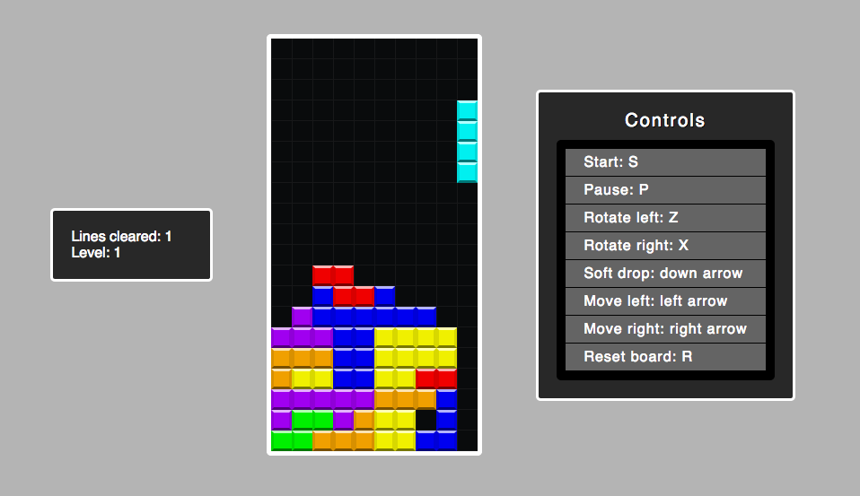
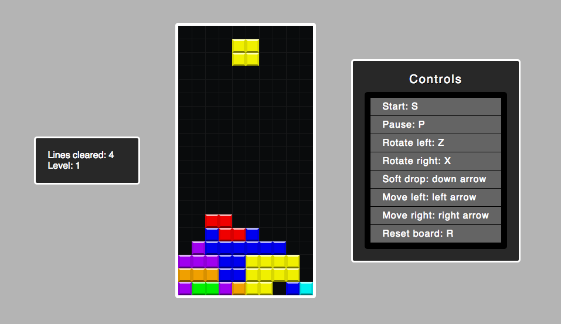

## Rest-It

[Live](https://zevgon.github.io/Rest-It)

### Implementation

Rest-It was built from the ground up using vanilla Javascript and CSS. That's it. No special libraries or canvas. There is a main.js file, which renders a new TetrisView to the page once the DOM content has been loaded. The TetrisView class's constructor creates a new instance of the Board class. The Board class has a toString() method, which produces the innerHTML of the tetris figure for the index.html file:

```node.js
toString () {
  let result = '';
  this.grid.forEach(row => {
    result += '<ul>';
    row.forEach(tile => {
      result += tile.toString();
    });
    result += '</ul>';
  });

  return result;
}
```

Each tile's toString method returns a string of an html `<li>` element, interpolating its class name:

```node.js
toString () {
  return `<li class=${this.className} />`
}
```

There are 7 piece types, each one hand-crafted using CSS classes and coordinate math. The rotation functionality, falling logic and line-clearing logic were all manually implemented.

### Features

Rest-It works just like Tetris. The pieces start falling slowly, one line per second, and once the player clears 10 lines, they advance to the next level and the speed increases slightly. Perhaps the most difficult feature to implement was clearing non-consecutive lines:

Before:



After:



The difficulty lay in shifting the position of the occupied squares of the "gap line" down a different number of spaces from all the occupied squares above the top-most cleared line. In the above example, the occupied squares of the gap line get moved down one square each, whereas all occupied squares above the top-most cleared line get moved down 3 squares each.

The controls include a "soft drop" option, which allows the player to drop the current falling piece down faster if they already know where they want it to go. This was very easy to implement because there is a `board.fall()` method, which gets called when the down arrow is pressed. The "level" feature was also quite easy to implement. The board keeps track of the total number of cleared lines, and each time new lines are cleared, it checks to see whether the total number of cleared lines gets pushed past a multiple of 10. If it does, the level increases by 1 and the speed increases by about 13%.

There are also options to start, pause, and reset the board. In combination, all these features allow for a seamless and exciting user experience.
